# **Data Lakes and Data Oceans Workshop**


Lab Manual

re:Invent 2017
---

© 2017 Amazon Web Services, Inc. and its affiliates. All rights reserved. This work may not be  reproduced or redistributed, in whole or in part, without prior written permission from Amazon Web Services, Inc. Commercial copying, lending, or selling is prohibited.

---
Overview
--------

A data lake is a repository that holds a large amount of raw data in its native
(structured or unstructured) format until the data is needed. Storing data in
its native format enables you to accommodate any future schema requirements or
design changes.

This Quick Start reference deployment guide provides step-by-step instructions
for deploying a data lake foundation on the AWS Cloud. The Quick Start builds a
data lake foundation that integrates AWS services such as Amazon Simple Storage
Service (Amazon S3), Amazon Redshift, Amazon Kinesis, Amazon Athena, Amazon
Elasticsearch Service (Amazon ES), and Amazon QuickSight.

Deployment Steps
----------------

### Step 1. Prepare Your AWS Account

1.  If you don’t already have an AWS account, [create
    one](https://portal.aws.amazon.com/billing/signup?nc2=h_ct&redirect_url=https%3A%2F%2Faws.amazon.com%2Fregistration-confirmation#/start)
    by following the on-screen instructions.

2.  Before the end of workshop, you will get a \$25 credit to cover the cost of this lab. You can apply that
    [here](https://console.aws.amazon.com/billing/home?#/credits). Remember to
    delete this lab at the end of this workshop, otherwise costs will accrue.

3.  Use the region selector in the navigation bar to [choose the us-west-2
    (Oregon)
    region](https://us-east-2.console.aws.amazon.com/console/home?region=us-west-2).

    

**Important** This Quick Start uses Kinesis Firehose, which is supported only in
the regions listed on the [AWS Regions and
Endpoints](http://docs.aws.amazon.com/general/latest/gr/rande.html#fh_region)
webpage. The Quick Start also uses Amazon Redshift Spectrum, which is supported
only in the regions [listed in the
documentation](http://docs.aws.amazon.com/redshift/latest/dg/c-spectrum-data-files.html)
for Amazon Redshift Spectrum.

4.  Create a [key
    pair](https://us-west-2.console.aws.amazon.com/ec2/v2/home?region=us-west-2#KeyPairs:sort=keyName)
    in the us-west-2 region.

    

-   Provide a name for the keypair.

-   When prompted, save the keypair to disk

5.  If necessary, [request a service limit
    increase](https://console.aws.amazon.com/support/home#/case/create?issueType=service-limit-increase&limitType=service-code-)
    for the Amazon EC2 **t2.micro** instance type. You might need to do this if
    you already have an existing deployment that uses this instance type, and
    you think you might exceed the [default
    limit](http://docs.aws.amazon.com/AWSEC2/latest/UserGuide/ec2-resource-limits.html)
    with this reference deployment.

6.  If necessary, [request a service limit
    increase](https://console.aws.amazon.com/support/home#/case/create?issueType=service-limit-increase&limitType=service-code-)
    for AWS CloudFormation stacks. The Quick Start will create up to eleven (11)
    stacks. You may need to request a service limit increase if you already have
    existing deployments that use AWS CloudFormation stacks.

### Step 2. Launch the Quick Start

1.  Deploy by [launching this CloudFormation
    stack](https://us-west-2.console.aws.amazon.com/cloudformation/home?region=us-west-2#/stacks/new?stackName=Data-lake-foundation&templateURL=https:%2F%2Fs3.amazonaws.com%2Fquickstart-reference%2Fdatalake%2F47lining%2Flatest%2Ftemplates%2Fdata-lake-master.template).
    This master stack will launch 10 more stacks. Total deployment time is about
    20-50 minutes to complete.

2.  On the **Select Template** page, keep the default setting for the template
    URL, and then choose **Next**.

    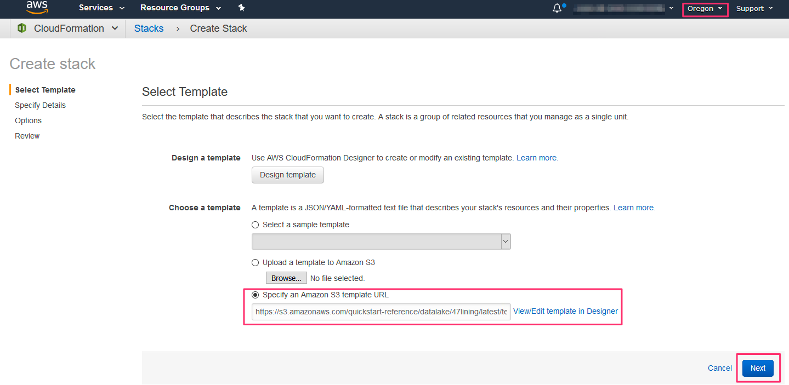

3.  On the **Specify Details** page, change the stack name if needed. Review the
    parameters for the template. Provide values for the parameters that require
    input. For all other parameters, review the default settings and customize
    them as necessary. When you finish reviewing and customizing the parameters,
    choose **Next**.

    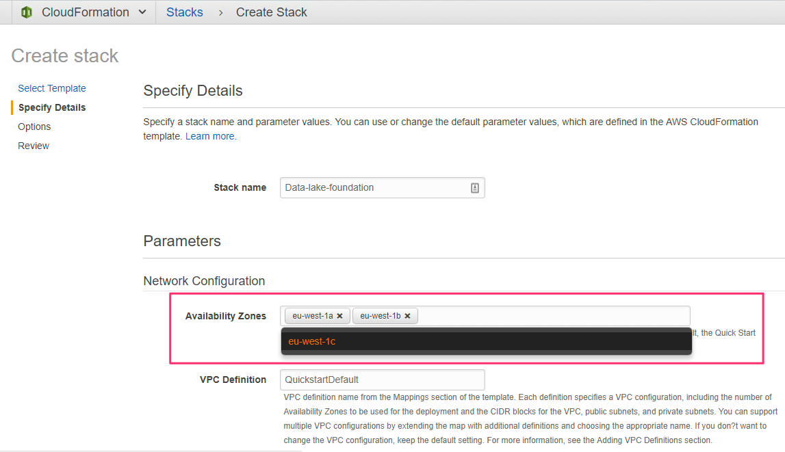

    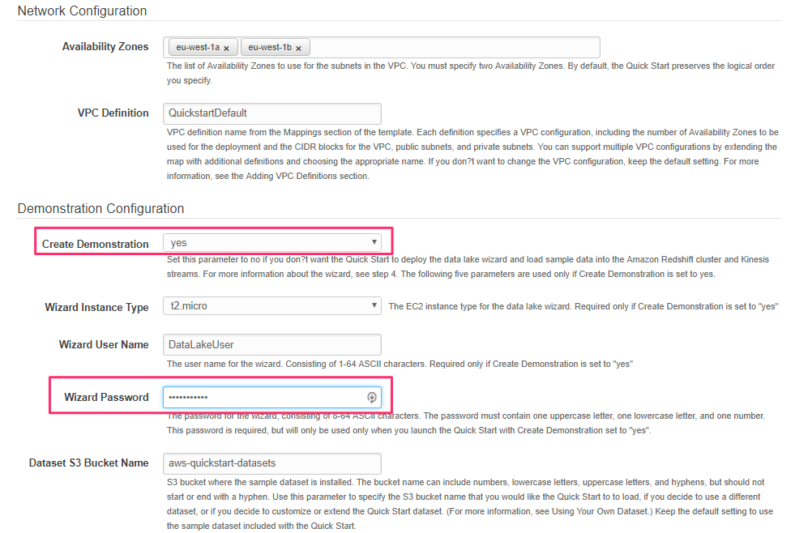

    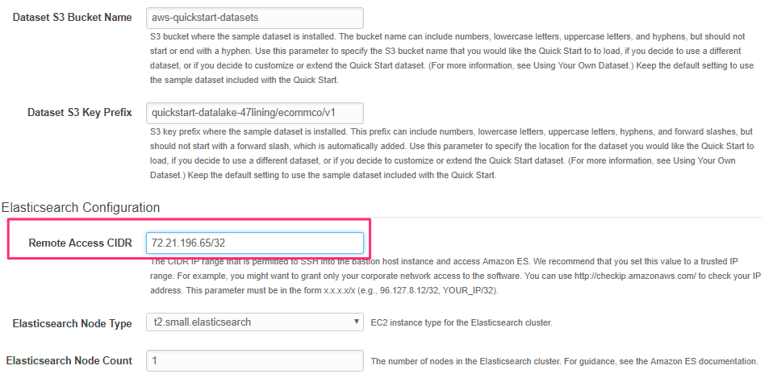

    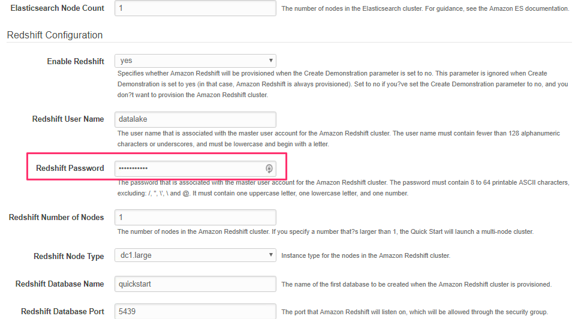

    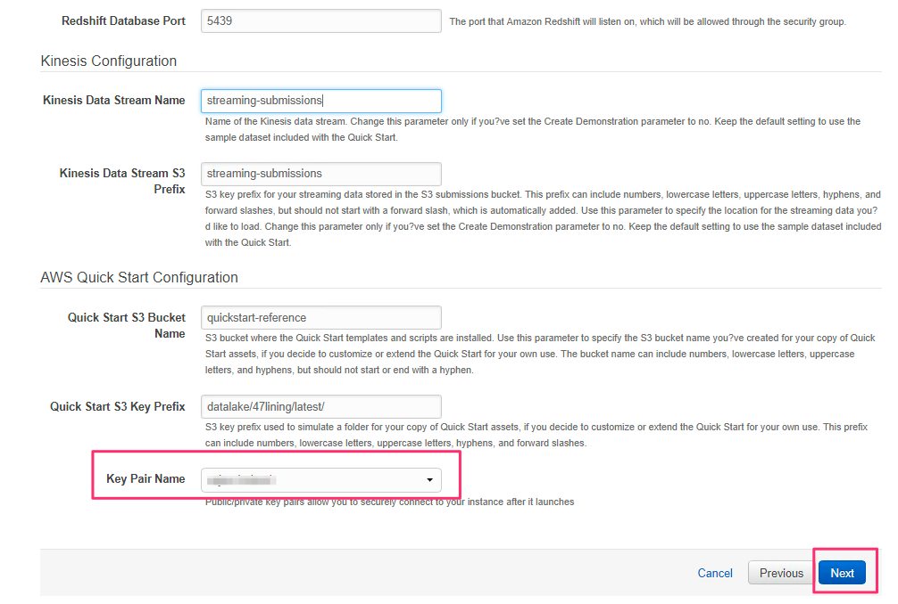

-   **Parameters for deploying the Quick Start into a new VPC**

    [View
    template](https://s3.amazonaws.com/quickstart-reference/datalake/47lining/latest/templates/data-lake-master.template)

    *Network Configuration:*

| Parameter label (name)                | Default           | Description                                                                                                                                                                                                                                                                                                                                                                                                                                                                                                                                                |
|---------------------------------------|-------------------|------------------------------------------------------------------------------------------------------------------------------------------------------------------------------------------------------------------------------------------------------------------------------------------------------------------------------------------------------------------------------------------------------------------------------------------------------------------------------------------------------------------------------------------------------------|
| Availability Zones                    | *Requires input*  | The list of Availability Zones to use for the subnets in the VPC. You must specify two Availability Zones. By default, the Quick Start preserves the logical order you specify.                                                                                                                                                                                                                                                                                                                                                                            |
| (AvailabilityZones)                   |                   |                                                                                                                                                                                                                                                                                                                                                                                                                                                                                                                                                            |
| VPC Definition                        | QuickstartDefault | VPC definition name from the Mappings section of the template. Each definition specifies a VPC configuration, including the number of Availability Zones to be used for the deployment and the CIDR blocks for the VPC, public subnets, and private subnets. You can support multiple VPC configurations by extending the map with additional definitions and choosing the appropriate name. If you don’t want to change the VPC configuration, keep the default setting. For more information, see the [Adding VPC Definitions](#delete-the-lab) section. |
| (VPCDefinition)                       |                   |                                                                                                                                                                                                                                                                                                                                                                                                                                                                                                                                                            |

*Demonstration Configuration:*

| Parameter label (name)                                                                                 | Default                                  | Description                                                                                                                                                                                                                                                                                                                                                                                                                                                                                                                                                                                                                                                                                                              |
|--------------------------------------------------------------------------------------------------------|------------------------------------------|--------------------------------------------------------------------------------------------------------------------------------------------------------------------------------------------------------------------------------------------------------------------------------------------------------------------------------------------------------------------------------------------------------------------------------------------------------------------------------------------------------------------------------------------------------------------------------------------------------------------------------------------------------------------------------------------------------------------------|
| **Create Demonstration**                                                                               | yes                                      | Keep this parameter as Yes. It will deploy the data lake wizard and load sample data into the Amazon Redshift cluster and Kinesis streams. For more information about the wizard, see [step 4](#step-4-use-the-wizard-to-explore-data-lake-features).                                                                                                                                                                                                                                                                                                                                                                                                                                                                    |
| (CreateDemonstration)                                                                                  |                                          |                                                                                                                                                                                                                                                                                                                                                                                                                                                                                                                                                                                                                                                                                                                          |
| The following five parameters are used only if Create Demonstration is set to yes, which is should be. |                                          |                                                                                                                                                                                                                                                                                                                                                                                                                                                                                                                                                                                                                                                                                                                          |
| **Wizard Instance Type**                                                                               | t2.micro                                 | The EC2 instance type for the data lake wizard.                                                                                                                                                                                                                                                                                                                                                                                                                                                                                                                                                                                                                                                                          |
| (WizardInstanceType)                                                                                   |                                          |                                                                                                                                                                                                                                                                                                                                                                                                                                                                                                                                                                                                                                                                                                                          |
| **Wizard User Name**                                                                                   | DataLakeUser                             | The user name for the wizard, consisting of 1-64 ASCII characters.                                                                                                                                                                                                                                                                                                                                                                                                                                                                                                                                                                                                                                                       |
| (WizardUsername)                                                                                       |                                          |                                                                                                                                                                                                                                                                                                                                                                                                                                                                                                                                                                                                                                                                                                                          |
| Wizard Password                                                                                        | *Requires input*                         | The password for the wizard, consisting of 8-64 ASCII characters. The password must contain one uppercase letter, one lowercase letter, and one number. This password is required, but it will be used only when you launch the Quick Start with **Create Demonstration** set to **yes**.                                                                                                                                                                                                                                                                                                                                                                                                                                |
| (WizardPassword)                                                                                       |                                          |                                                                                                                                                                                                                                                                                                                                                                                                                                                                                                                                                                                                                                                                                                                          |
| Dataset S3 Bucket Name                                                                                 | aws-quickstart-datasets                  | S3 bucket where the sample dataset is installed. The bucket name can include numbers, lowercase letters, uppercase letters, and hyphens, but should not start or end with a hyphen. Keep the default setting to use the [sample dataset included with the Quick Start](#quick-start-dataset). If you decide to use a different dataset, or if you decide to customize or extend the Quick Start dataset, use this parameter to specify the S3 bucket name that you would like the Quick Start to to load. (For more information, see [Using Your Own Dataset](#optional-using-your-own-dataset).)                                                                                                                        |
| (DatasetS3BucketName)                                                                                  |                                          |                                                                                                                                                                                                                                                                                                                                                                                                                                                                                                                                                                                                                                                                                                                          |
| Dataset S3 Key Prefix                                                                                  | quickstart-datalake-47lining/            | [S3 key prefix](https://docs.aws.amazon.com/AmazonS3/latest/dev/UsingMetadata.html) where the sample dataset is installed. This prefix can include numbers, lowercase letters, uppercase letters, hyphens, and forward slashes, but should not start with a forward slash, which is automatically added. Keep the default setting to use the [sample dataset included with the Quick Start](#quick-start-dataset). If you decide to use a different dataset, or if you decide to customize or extend the Quick Start dataset, use this parameter to specify the location for the dataset you would like the Quick Start to load. (For more information, see [Using Your Own Dataset](#optional-using-your-own-dataset).) |
| (DatasetS3KeyPrefix)                                                                                   | ecommco/v1/                              |                                                                                                                                                                                                                                                                                                                                                                                                                                                                                                                                                                                                                                                                                                                          |

>   *Elasticsearch Configuration:*

| Parameter label (name)                           | Default                | Description                                                                                                                                                                                                                                                                                                                                                                                                 |
|--------------------------------------------------|------------------------|-------------------------------------------------------------------------------------------------------------------------------------------------------------------------------------------------------------------------------------------------------------------------------------------------------------------------------------------------------------------------------------------------------------|
| Remote Access CIDR                               | *Requires input*       | The CIDR IP range that is permitted to SSH into the bastion host instance and access Amazon ES. We recommend that you set this value to a trusted IP range. For example, you might want to grant only your corporate network access to the software. You can use <http://checkip.amazonaws.com/> to check your IP address. This parameter must be in the form x.x.x.x/x (e.g., 96.127.8.12/32, YOUR_IP/32). For re:Invent only, use 0.0.0.0/0 |
| (RemoteAccessCIDR)                               |                        |                                                                                                                                                                                                                                                                                                                                                                                                             |
| Elasticsearch Node Type                          | t2.small.              | EC2 instance type for the Elasticsearch cluster.                                                                                                                                                                                                                                                                                                                                                            |
| (ElasticsearchNodeType)                          | elasticsearch          |                                                                                                                                                                                                                                                                                                                                                                                                             |
| Elasticsearch Node Count                         | 1                      | The number of nodes in the Elasticsearch cluster. For guidance, see the [Amazon ES documentation](http://docs.aws.amazon.com/elasticsearch-service/latest/developerguide/aes-supported-instance-types.html).                                                                                                                                                                                                |
| (ElasticsearchNodeCount)                         |                        |                                                                                                                                                                                                                                                                                                                                                                                                             |

>   *Redshift Configuration:*

| Parameter label (name)                          | Default          | Description                                                                                                                                                                                                                                                                                                                                                                                     |
|-------------------------------------------------|------------------|-------------------------------------------------------------------------------------------------------------------------------------------------------------------------------------------------------------------------------------------------------------------------------------------------------------------------------------------------------------------------------------------------|
| Enable Redshift                                 | yes              | Specifies whether Amazon Redshift will be provisioned when the **Create Demonstration** parameter is set to **no**. This parameter is ignored when **Create Demonstration** is set to **yes** (in that case, Amazon Redshift is always provisioned). Set to **no** if you’ve set the **Create Demonstration** parameter to **no**, and you don’t want to provision the Amazon Redshift cluster. |
| (EnableRedshift)                                |                  |                                                                                                                                                                                                                                                                                                                                                                                                 |
| **Redshift User Name**                          | datalake         | The user name that is associated with the master user account for the Amazon Redshift cluster. The user name must contain fewer than 128 alphanumeric characters or underscores, and must be lowercase and begin with a letter.                                                                                                                                                                 |
| (RedshiftUsername)                              |                  |                                                                                                                                                                                                                                                                                                                                                                                                 |
| Redshift Password                               | *Requires input* | The password that is associated with the master user account for the Amazon Redshift cluster. The password must contain 8-64 printable ASCII characters, excluding: /, ", \\', \\ and \@. It must contain one uppercase letter, one lowercase letter, and one number.                                                                                                                           |
| (RedshiftPassword)                              |                  |                                                                                                                                                                                                                                                                                                                                                                                                 |
| Redshift Number of Nodes                        | 1                | The number of nodes in the Amazon Redshift cluster. If you specify a number that’s larger than 1, the Quick Start will launch a multi-node cluster.                                                                                                                                                                                                                                             |
| (RedshiftNumberOfNodes)                         |                  |                                                                                                                                                                                                                                                                                                                                                                                                 |
| Redshift Node Type                              | dc1.large        | Instance type for the nodes in the Amazon Redshift cluster.                                                                                                                                                                                                                                                                                                                                     |
| (RedshiftNodeType)                              |                  |                                                                                                                                                                                                                                                                                                                                                                                                 |
| Redshift Database Name                          | quickstart       | The name of the first database to be created when the Amazon Redshift cluster is provisioned.                                                                                                                                                                                                                                                                                                   |
| (RedshiftDatabaseName)                          |                  |                                                                                                                                                                                                                                                                                                                                                                                                 |
| Redshift Database Port                          | 5439             | The port that Amazon Redshift will listen on, which will be allowed through the security group.                                                                                                                                                                                                                                                                                                 |
| (RedshiftDatabasePort)                          |                  |                                                                                                                                                                                                                                                                                                                                                                                                 |

>   *Kinesis Configuration:*

| Parameter label (name)                                       | Default               | Description                                                                                                                                                                                                                                                                                                                                                                                                                                                                                                                                                                                                               |
|--------------------------------------------------------------|-----------------------|---------------------------------------------------------------------------------------------------------------------------------------------------------------------------------------------------------------------------------------------------------------------------------------------------------------------------------------------------------------------------------------------------------------------------------------------------------------------------------------------------------------------------------------------------------------------------------------------------------------------------|
| **Kinesis Data Stream Name**                                 | streaming-submissions | Name of the Kinesis data stream. Change this parameter only if you’ve set the **Create Demonstration** parameter to **no**. Keep the default setting to use the [sample dataset included with the Quick Start](#quick-start-dataset).                                                                                                                                                                                                                                                                                                                                                                                     |
| (KinesisDataStreamName)                                      |                       |                                                                                                                                                                                                                                                                                                                                                                                                                                                                                                                                                                                                                           |
| **Kinesis Data Stream S3 Prefix**                            | streaming-submissions | [S3 key prefix](https://docs.aws.amazon.com/AmazonS3/latest/dev/UsingMetadata.html) for your streaming data stored in the S3 submissions bucket. This prefix can include numbers, lowercase letters, uppercase letters, hyphens, and forward slashes, but should not start with a forward slash, which is automatically added. Use this parameter to specify the location for the streaming data you’d like to load. Change this parameter only if you’ve set the **Create Demonstration** parameter to **no**. Keep the default setting to use the [sample dataset included with the Quick Start](#quick-start-dataset). |
| (KinesisDataStreamS3                                         |                       |                                                                                                                                                                                                                                                                                                                                                                                                                                                                                                                                                                                                                           |
| Prefix)                                                      |                       |                                                                                                                                                                                                                                                                                                                                                                                                                                                                                                                                                                                                                           |

*AWS Quick Start Configuration:*

| Parameter label (name)                     | Default                   | Description                                                                                                                                                                                                                                                                                                                                                                         |
|--------------------------------------------|---------------------------|-------------------------------------------------------------------------------------------------------------------------------------------------------------------------------------------------------------------------------------------------------------------------------------------------------------------------------------------------------------------------------------|
| Quick Start S3 Bucket Name                 | quickstart-reference      | S3 bucket where the Quick Start templates and scripts are installed. Use this parameter to specify the S3 bucket name you’ve created for your copy of Quick Start assets, if you decide to customize or extend the Quick Start for your own use. The bucket name can include numbers, lowercase letters, uppercase letters, and hyphens, but should not start or end with a hyphen. |
| (QSS3BucketName)                           |                           |                                                                                                                                                                                                                                                                                                                                                                                     |
| Quick Start S3 Key Prefix                  | datalake/47lining         | [S3 key prefix](https://docs.aws.amazon.com/AmazonS3/latest/dev/UsingMetadata.html) used to simulate a folder for your copy of Quick Start assets, if you decide to customize or extend the Quick Start for your own use. This prefix can include numbers, lowercase letters, uppercase letters, hyphens, and forward slashes.                                                      |
| (QSS3KeyPrefix)                            | /latest/                  |                                                                                                                                                                                                                                                                                                                                                                                     |

4.  On the **Options** page, you can [specify
    tags](https://docs.aws.amazon.com/AWSCloudFormation/latest/UserGuide/aws-properties-resource-tags.html)
    (key-value pairs) for resources in your stack and [set advanced
    options](https://docs.aws.amazon.com/AWSCloudFormation/latest/UserGuide/cfn-console-add-tags.html).
    When you’re done, choose **Next**.

    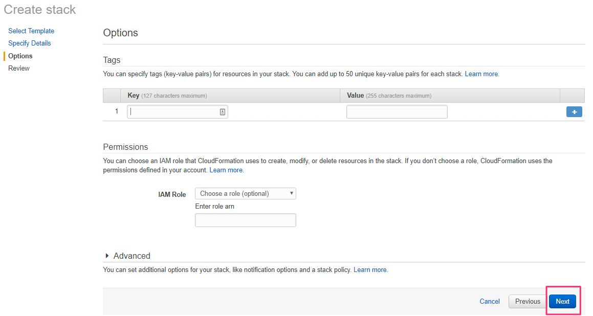

2.  On the **Review** page, review and confirm the template settings. Under
    **Capabilities**, select the check box to acknowledge that the template will
    create IAM resources.

    

3.  Choose **Create** to deploy the stack.

4.  Monitor the status of the stack. When the status is **CREATE_COMPLETE**, the
    data lake cluster is ready.

5.  You can use the information displayed in the **Outputs** tab for the stack
    to view the resources that were created and to verify the deployment, as
    discussed in the next step.

### Step 3. Test the Deployment

Validate and test the deployment by checking the resources in the **Outputs**
tab.


Figure 7: Quick Start outputs

You should confirm the following:

-   The S3 buckets listed on the **Outputs** tab for the stack are available in
    the Amazon S3 console. The Quick Start provisions distinct S3 buckets for
    submissions, curated datasets, and published results.

-   If you launched the Quick Start with **Enable Redshift** set to **yes**,
    Amazon Redshift is accessible at the Java Database Connectivity (JDBC)
    endpoint specified on the **Outputs** tab for the stack, using the
    **Redshift User Name** and **Redshift Password** that you specified when you
    launched the Quick Start.

-   The Kinesis stream for streaming submissions listed on the **Outputs** tab
    for the stack is available in the Kinesis console.

-   The ElasticSearch cluster listed on the **Outputs** tab for the stack is
    available in the Amazon ES console, and the Kibana endpoint listed on the
    **Outputs** tab is accessible from a web browser client within the **Remote
    Access CIDR** that you specified when launching the Quick Start.

### Step 4: Use the Wizard to Explore Data Lake Features 

If the **Create Demonstration** parameter is set to **yes** (its default
setting), you’ll see a URL for the wizard in the **Outputs** tab, and you can
use the wizard to explore the data lake architecture and the AWS services used
within this Quick Start. The wizard includes eight steps, each of which
demonstrates and explains a particular data lake feature. For example, step 2 of
the wizard walks you through the process for promoting data from the S3
submissions bucket to the curated datasets bucket, step 3 demonstrates how to
start the flow from a streaming data provider, and so on, all within your AWS
account.

1.  Choose the URL for **DataLakeWizardURL** in the **Outputs** tab, and open it
    in a web browser.

2.  Log in to the wizard by using the parameters you specified during
    deployment: Use the value of **Wizard User Name** as your login name, and
    **Wizard Password** as your password.

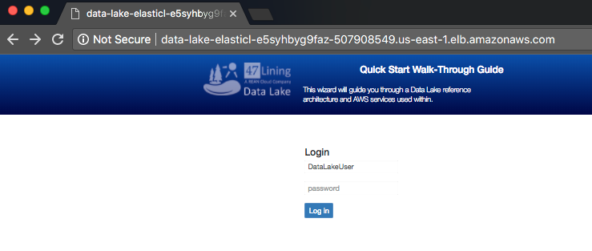

Figure 8: Login page of wizard

3.  On the **Get Started** screen, read the directions carefully to learn how to
    step through the path from initial data submission to transformations, to
    analytics, and finally to visualizations.

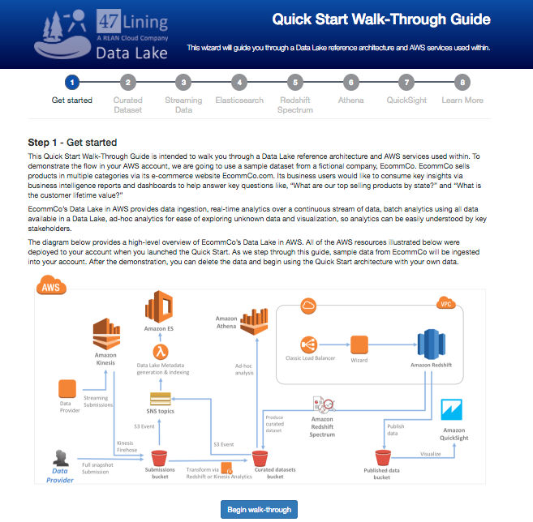

Figure 9: Getting started with the wizard

### Optional: Using Your Own Dataset

You can deploy this Quick Start without the sample dataset and wizard, and
extend it with your own dataset instead. To do so, set the **Create
Demonstration** parameter to **no**. You can then use the following
infrastructure, which the Quick Start sets up:

-   Kinesis Firehose endpoint, which accepts streaming submissions into the S3
    submissions bucket

-   Amazon Redshift, which is optionally deployed into a private subnet, to
    ingest data from Amazon S3 or through JDBC, and analyze it

-   Elasticsearch cluster, which provides you with a data lake dashboard of all
    S3 objects that were placed in the S3 submissions bucket, curated datasets
    bucket, and published datasets bucket

The data lake foundation provides a solid base for your processes. Using this
infrastructure, you can:

-   Ingest batch submissions, resulting in curated datasets in Amazon S3. You
    can then use your own SQL scripts to load curated datasets to Amazon
    Redshift.

-   Ingest streaming submissions provided through Kinesis Firehose.

-   Analyze the data with Amazon Redshift, using your own SQL queries.

-   Analyze the data with Kinesis Analytics, by creating your own applications
    that read streaming data from Kinesis Firehose.

-   Publish the results of analytics to the published datasets bucket.

-   Get a high-level picture of your data lake by using Amazon ES, which indexes
    the metadata of S3 objects.

-   Use Amazon Athena to run ad-hoc analytics over your curated datasets, and
    Amazon QuickSight to visualize the datasets in the published datasets
    bucket. You can also use Amazon Athena or Amazon Redshift as data sources in
    AWS QuickSight.

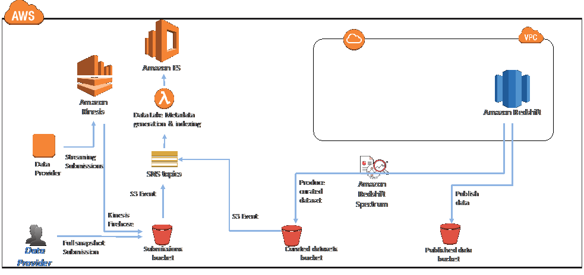

Figure 10: Infrastructure deployed when launching Quick Start without
demonstration

### Delete the lab

When you’re done, delete the resources created by this deployment by going to
the CloudFormation page and deleting the root stack.

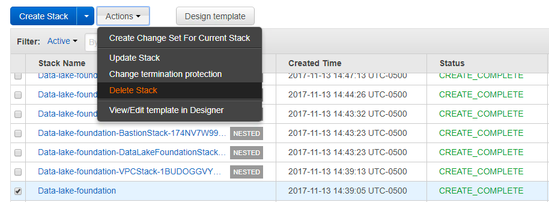

 Before the end of workshop, you will get a \$25 credit to cover the cost of this lab. Don't forget to apply that
    [here](https://console.aws.amazon.com/billing/home?#/credits).
## Optional Exercise ##


This optional exercise will allow you to build a schema-on-read analytical
pipeline, similar to the one used with relational databases, using [Amazon
Athena](https://aws.amazon.com/athena). Athena is a serverless analytical query
engine that allows you to start querying data stored in [Amazon
S3](https://aws.amazon.com/s3) instantly. It supports standard formats like CSV
and Parquet and integrates with [Amazon
QuickSight](https://aws.amazon.com/quicksight), which allows you to build
interactive business intelligence reports.

For this optional exercise, you will use the healthcare dataset from the Centers
for Disease Control (CDC) [Behavioral Risk Factor Surveillance system
(BRFSS)](https://www.cdc.gov/brfss/). This dataset is based on data gathered by
the CDC via telephone surveys for health-related risk behaviors and conditions,
and the use of preventive health services. The BRFSS dataset is available as zip
files from the [CDC FTP portal](ftp://ftp.cdc.gov/pub/Data/Brfss/) for general
download and analysis; this dataset will be in the form of CSV files. There is
also a [user guide](ftp://ftp.cdc.gov/pub/Data/Brfss/userguide.pdf) with
comprehensive details about the program and the process of collecting data.

In this exercise, S3 will be the central data repository for the CSV files,
which are divided by behavioral risk factors like smoking, drinking, obesity,
and high blood pressure.

You will use Athena to collectively query the CSV files in S3. It uses the [AWS
Glue Data
Catalog](http://docs.aws.amazon.com/glue/latest/dg/components-overview.html) to
maintain the schema details and applies it at the time of querying the data.

The dataset will be further filtered and transformed into a subset that is
specifically used for reporting with Amazon QuickSight.

### Data staging in S3 ###

The data ingestion into S3 is fairly straightforward. The BRFSS files can be
ingested via the S3 command line interface (CLI), API, or the AWS Management
Console. The data files are in CSV format and already divided by the behavioral
condition. To improve performance, we recommend that you use [partitioned data
with Athena](http://docs.aws.amazon.com/athena/latest/ug/partitions.html),
especially when dealing with large volumes. You can use pre-partitioned data in
S3 or build partitions later in the process. The example you are working with
has a total of 247 CSV files storing about 205 MB of data across them, but
typical production scale deployment would be much larger.

**Filter and data transformation**

To filter and transform the BRFSS dataset, first observe the overall counts and
structure of the data. This will allow you to choose the columns that are
important for a given report and use the filter clause to extract a subset of
the data. Transforming the data as you progress through the pipeline ensures
that you are only exposing relevant data to the reporting layer, to optimize
performance.

To look at the entire dataset, [create a table in
Athena](http://docs.aws.amazon.com/athena/latest/ug/getting-started.html#step-2-create-a-table)
to go across the entire data volume. This can be done using the following query:
```
CREATE EXTERNAL TABLE IF NOT EXISTS brfsdata(
    ID STRING,
    HIW STRING,
    SUSA_NAME STRING,
    MATCH_NAME STRING,
    CHSI_NAME STRING,
    NSUM STRING,
    MEAN STRING,
    FLAG STRING,
    IND STRING,
    UP_CI STRING,
    LOW_CI STRING,
    SEMEAN STRING,
    AGE_ADJ STRING,
    DATASRC STRING,
    FIPS STRING,
    FIPNAME STRING,
    HRR STRING,
    DATA_YR STRING,
    UNIT STRING,
    AGEGRP STRING,
    GENDER STRING,
    RACE STRING,
    EHN STRING,
    EDU STRING,
    FAMINC STRING,
    DISAB STRING,
    METRO STRING,
    SEXUAL STRING,
    FAMSTRC STRING,
    MARITAL STRING,
    POP_SPC STRING,
    POP_POLICY STRING
)
ROW FORMAT DELIMITED
FIELDS TERMINATED BY ','
ESCAPED BY '\\\\'
LINES TERMINATED BY '\\n'
LOCATION "s3://\<YourBucket/YourPrefix\>"
```
Replace *YourBucket* and *YourPrefix* with your corresponding values.

In this case, there are a total of \~1.4 million records, which you get by
running a simple COUNT(\*) query on the table.

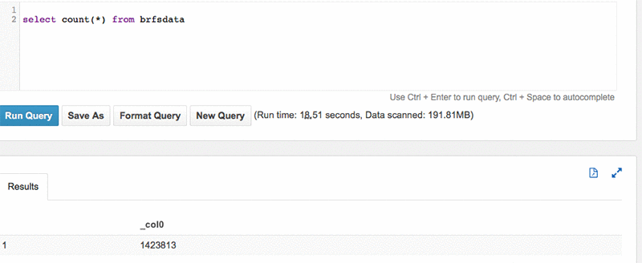

From here, you can run multiple analysis queries on the dataset. For example,
you can find the number of records that fall into a certain behavioral risk, or
the state that has the highest number of diabetic patients recorded. These
metrics provide data points that help to determine the attributes that would be
needed from a reporting perspective.

**Reporting table**

After you have completed the source data analysis, the next step is to filter
out the required data and transform it to create a reporting database. Based on
the analysis carried out in the previous step, you might notice some mismatches
with the data headers. You might also identify the filter clauses to apply to
the dataset to get to your reporting data.

Athena automatically saves query results in S3 for every run. The default bucket
for this is created in the following format:

aws-athena-query-results-\<AWS Account ID\>-\<AWS Region\>

Athena creates a prefix for each saved query and stores the result set as CSV
files organized by dates. You can use this feature to filter out result datasets
and store them in an S3 bucket for reporting.

To enable this, create queries that can filter out and transform the subset of
data on which to report. For this use case, create three separate queries to
filter out unwanted data and fix the column headers:

**Query 1:**

```SELECT ID, up_ci AS source, semean AS state, datasrc
AS year, fips AS unit, fipname AS age,mean, current_date AS dt, current_time AS tm 
FROM brfsdata
WHERE ID != '' AND hrr IS NULL AND semean NOT LIKE '%29193%'
```
**Query 2:**
```
SELECT ID, up_ci AS source, semean AS state, datasrc
AS year, fips AS unit, fipname AS age,mean, current_date AS dt, current_time AS tm
FROM brfsdata WHERE ID != '' AND hrr IS NOT NULL AND up_ci LIKE '%BRFSS%'and
semean NOT LIKE '"%' AND semean NOT LIKE '%29193%'
```
**Query 3:**
```
SELECT ID, low_ci AS source, age_adj AS state, fips
AS year, fipname AS unit, hrr AS age,mean, current_date AS dt, current_time AS tm
FROM brfsdata WHERE ID != '' AND hrr IS NOT NULL AND up_ci NOT LIKE '%BRFSS%'
AND age_adj NOT LIKE '"%' AND semean NOT LIKE '%29193%' AND low_ci LIKE 'BRFSS'
```
You can save these queries in Athena so that you can get to the query results
easily every time they are executed. The following screenshot is an example of
the results when query 1 is executed four times.


The next step is to copy these results over to a new bucket for creating your
reporting table. This can be done by running an S3 CP command from the CLI or
API, as shown below. Replace YourReportingBucket, YourReportingPrefix and
Account ID with your corresponding values.

```aws s3 cp
s3://aws-athena-query-results-YOUR_ACCOUNT_ID-us-east-1/Query1/2017/03/23/
s3://\<YourReportingBucket/YourReportingPrefix\> --recursive --exclude "\*.\*"
--include "\*.csv"
```
Note the prefix structure in which Athena stores query results. It creates a
separate prefix for each day in which the query is executed, and stores the
corresponding CSV and metadata file for each run. Copy the result set over to a
new prefix on S3 for Reporting Data. Use the “exclude” and “include” option of
S3 CP to only copy the CSV files and use “recursive” to copy all the files from
the run.

You can replace the value of the saved query name from “Query1” to “Query2” or
“Query3” to copy all data resulting from those queries to the same target
prefix. For pipelines that require more complicated transformations, divide the
query transformation into multiple steps and execute them based on events or
schedule them, as described in the earlier data staging step.

**Amazon QuickSight dashboard**

After the filtered results sets are copied as CSV files into the new Reporting
Data prefix, create a new table in Athena that is used specifically for BI
reporting. This can be done using a create table statement similar to the one
below. Replace YourReportingBucket and YourReportingPrefix with your
corresponding values.
```
CREATE EXTERNAL TABLE IF NOT EXISTS BRFSS_REPORTING(
    ID varchar(100),
    source varchar(100),
    state varchar(100),
    year int,
    unit varchar(10),
    age varchar(10),
    mean float
)
ROW FORMAT DELIMITED
FIELDS TERMINATED BY ','
ESCAPED BY '\\\\'
LINES TERMINATED BY '\\n'
LOCATION "s3://\<YourReportingBucket/YourReportingPrefix\>"
```
This table can now act as a source for a dashboard on Amazon QuickSight, which
is a straightforward process to enable. When you choose a new data source,
Athena shows up as an option and Amazon QuickSight automatically detects the
tables in Athena that are exposed for querying. Here are the data sources
supported by Athena at the time of this post:

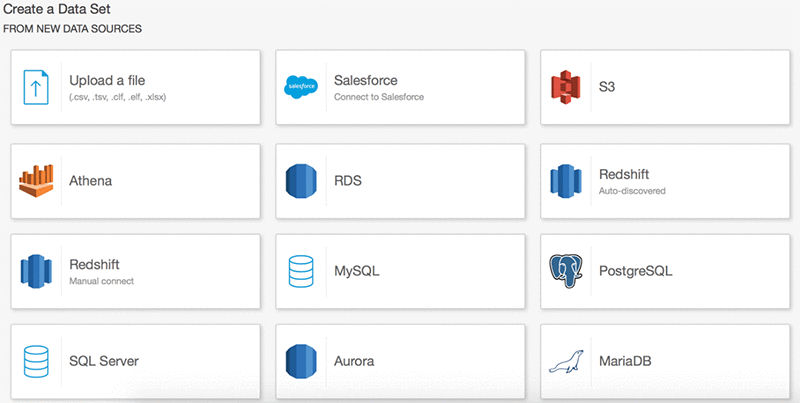

After choosing Athena, give a name to the data source and choose the database.
The tables available for querying automatically show up in the list.

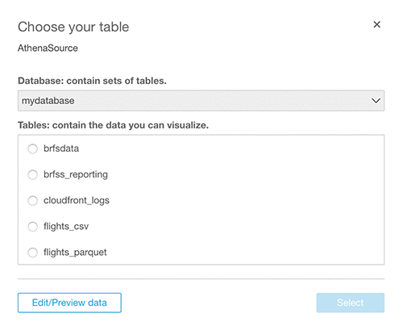

If you choose “BRFSS_REPORTING”, you can create custom metrics using the columns
in the reporting table, which can then be used in reports and dashboards.

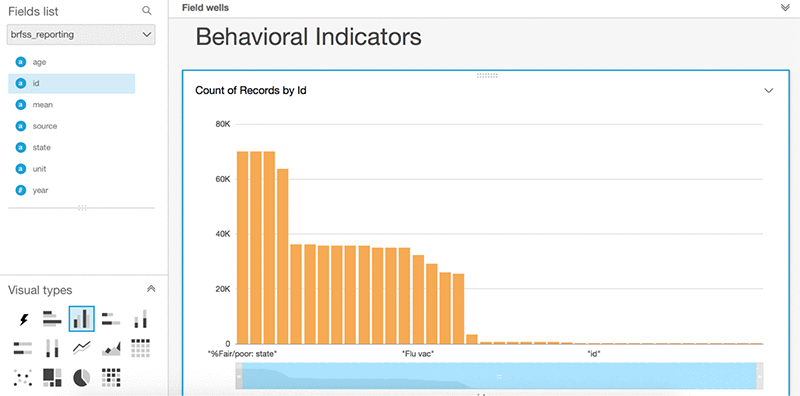

For more information about features and visualizations, see the [Amazon
QuickSight User
Guide](http://docs.aws.amazon.com/quicksight/latest/user/welcome.html).

Troubleshooting and FAQ
-----------------------

**Q.** I encountered a CREATE_FAILED error when I launched the Quick Start. What
should I do?

**A.** If AWS CloudFormation fails to create the stack, we recommend that you
relaunch the template with **Rollback on failure** set to **No**. (This setting
is under **Advanced** in the AWS CloudFormation console, **Options** page.) With
this setting, the stack’s state will be retained and the instance will be left
running, so you can troubleshoot the issue. (You'll want to look at the log
files in %ProgramFiles%\\Amazon\\EC2ConfigService and C:\\cfn\\log.)

>   **Important** When you set **Rollback on failure** to **No**, you’ll
>   continue to incur AWS charges for this stack. Please make sure to delete the
>   stack when you’ve finished troubleshooting.

For additional information, see [Troubleshooting AWS
CloudFormation](https://docs.aws.amazon.com/AWSCloudFormation/latest/UserGuide/troubleshooting.html)
on the AWS website.

**Q.** I encountered a size limitation error when I deployed the AWS
Cloudformation templates.

**A.** We recommend that you launch the Quick Start templates from the location
we’ve provided or from another S3 bucket. If you deploy the templates from a
local copy on your computer, you might encounter template size limitations when
you create the stack. For more information about AWS CloudFormation limits, see
the [AWS
documentation](http://docs.aws.amazon.com/AWSCloudFormation/latest/UserGuide/cloudformation-limits.html).

**Q.** I deployed the Quick Start in the EU (London) Region, but it didn’t work.

**A.** This Quick Start includes services that aren’t supported in all regions.
See the pages for [Amazon Kinesis
Firehose](http://docs.aws.amazon.com/general/latest/gr/rande.html#fh_region) and
[Amazon Redshift
Spectrum](http://docs.aws.amazon.com/redshift/latest/dg/c-spectrum-data-files.html)
on the AWS website for a list of supported regions.

**Q.** Can I use the QuickStart with my own data?

**A.** Yes, you can. See the section [Optional: Using Your Own
Dataset](#optional-using-your-own-dataset).

**Q.** I encountered a problem accessing the Kibana dashboard in Amazon ES.

**A.** Amazon ES is protected from public access. Make sure that your IP matches
the input parameter **Remote Access CIDR**, which is white-listed for Amazon ES.

## Appendix ##

### Data Lake Foundation Background ###

The data lake foundation provides these features:

-   **Data submission**, including batch submissions to Amazon S3 and streaming
    submissions via Amazon Kinesis Firehose.

-   **Ingest processing**, including data validation, metadata extraction, and
    indexing via Amazon S3 events, Amazon Simple Notification Service (Amazon
    SNS), AWS Lambda, Amazon Kinesis Analytics, and Amazon ES.

-   **Dataset management** through Amazon Redshift transformations and Kinesis
    Analytics.

-   **Data transformation, aggregation, and analysis** through Amazon Athena and
    Amazon Redshift Spectrum.

-   **Search**, by indexing metadata in Amazon ES and exposing it through Kibana
    dashboards.

-   **Publishing** into an S3 bucket for use by visualization tools.

-   **Visualization** with Amazon QuickSight.

    The usage model diagram in Figure 1 illustrates key actors and use cases
    that the data lake enables, in context with the key component areas that
    comprise the data lake. This Quick Start provisions foundational data lake
    capabilities and optionally demonstrates key use cases for each type of
    actor in the usage model.

    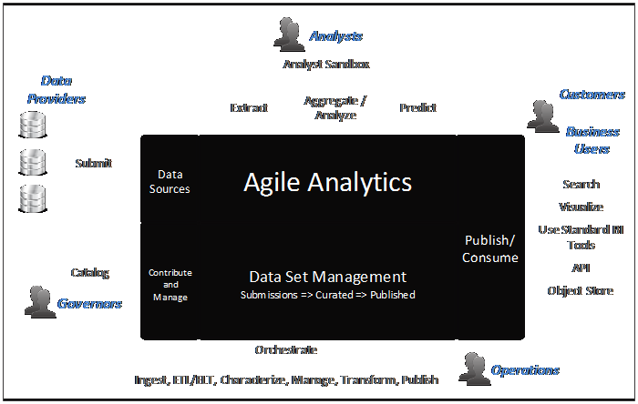

Figure 1: Usage model for Data Lake Foundation Quick Start

Figure 2 illustrates the foundational solution components of the data lake and
how they relate to the usage model. The solution components interact through
recurring and repeatable data lake patterns using your data and business flow.

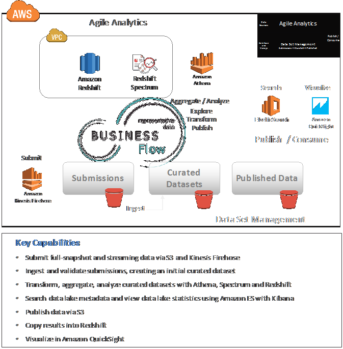

**Figure 2: Capabilities and solution components in the Data Lake foundation
Quick Start**

The Quick Start also deploys an optional wizard and a sample dataset. You can
use the wizard after deployment to explore the architecture and functionality of
the data lake foundation and understand how they relate to repeatable data lake
patterns. For more information, see [step
4](#step-4-use-the-wizard-to-explore-data-lake-features) in the deployment
instructions.

Whether or not you choose to deploy the wizard and sample dataset, the Quick
Start implementation is consistent with foundational data lake concepts that
span physical architecture, data flow and orchestration, governance, and data
lake usage and operations.

To learn more about 47Lining, foundational data lake concepts and reference
architecture, and how to extend your data lake beyond this Quick Start
implementation, see the [47Lining data lake
resources](http://www.47lining.com/datalake/) page.

Architecture
------------

Deploying this Quick Start for a [new virtual private cloud
(VPC)](#quick-start-dataset) with **default parameters** builds the following
data lake environment in the AWS Cloud.


Figure 3: Quick Start architecture for data lake foundation on the AWS Cloud

The Quick Start sets up the following:

-   A virtual private cloud (VPC) that spans two Availability Zones and includes
    two public and two private subnets.\*

-   An Internet gateway to allow access to the Internet.\*

-   In the public subnets, managed NAT gateways to allow outbound Internet
    access for resources in the private subnets.\*

-   In the public subnets, Linux bastion hosts in an Auto Scaling group to allow
    inbound Secure Shell (SSH) access to EC2 instances in public and private
    subnets.\*

-   In a private subnet, a web application instance that hosts an optional
    wizard, which guides you through the data lake architecture and
    functionality.

-   IAM roles to provide permissions to access AWS resources; for example, to
    permit Amazon Redshift and Amazon Athena to read and write curated datasets.

-   In the private subnets, Amazon Redshift for data aggregation, analysis,
    transformation, and creation of curated and published datasets. When you
    launch the Quick Start with **Create Demonstration** set to **yes,** Amazon
    Redshift is launched in a public subnet.

-   Integration with other Amazon services such as Amazon S3, Amazon Athena, AWS
    Lambda, Amazon ES with Kibana, Amazon Kinesis, and Amazon QuickSight.

Figure 4 shows how these components work together in a typical end-to-end
process flow. If you choose to deploy the Quick Start with the wizard and sample
dataset, the wizard will guide you through this process flow and core data lake
concepts using sample data, which is described in the [Quick Start
Dataset](#quick-start-dataset) section.

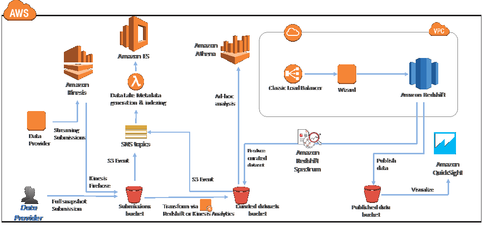

Figure 4: Data lake foundation process flow

The process flow consists of the following:

-   **Submit**. Distinct submission processes accept both batch submissions to
    an S3 submissions bucket and streaming submissions via Amazon Kinesis
    Firehose.

    All data lake submissions are indexed in Amazon ES, triggered by Amazon S3
    events.

-   **Ingest**. Ingest processes validate submissions, create characterization
    metadata, and, in some cases, transform submissions as they are accepted
    into the data lake and maintained as curated datasets.

-   **Curated datasets**. Curated datasets provide the foundation for a
    value-tiering strategy within the data lake. The simplest curated datasets
    minimally transform submissions, so that historic submissions can be
    “replayed” to obtain a correct, full dataset representation. Higher-value
    curated datasets combine multiple input datasets using an agile analytic
    transform. Amazon Redshift or Amazon Kinesis Analytics implement these
    transforms and create the resulting curated datasets. Curated datasets
    reside in a dedicated S3 bucket. They are also indexed in Amazon ES.

-   **Agile analytics to transform, aggregate, analyze**. Amazon Athena performs
    ad-hoc analyses on the curated datasets, and Amazon Redshift Spectrum helps
    join dimensional data with facts. You can choose the right analytics engine
    for the job to create and maintain each curated dataset, based on your data
    and the requirements and preferences of your analysts.

-   **Search**. Search is enabled by indexing metadata in Amazon ES and exposing
    it through Kibana dashboards. When new data is added to Amazon S3, it
    triggers events, which are published to Amazon SNS. Amazon SNS triggers AWS
    Lambda functions to index the metadata in Amazon ES.

-   **Publish results**. The publishing process moves and transforms data from
    the S3 curated datasets bucket to the published results buckets for
    downstream consumers like Amazon QuickSight or a dedicated analyst sandbox.

-   **Visualize**. Published results are visualized with Amazon QuickSight.

Quick Start Dataset
-------------------

The Quick Start includes an optional sample dataset, which it loads into the
Amazon Redshift cluster and Kinesis streams. The data lake wizard uses this
dataset to demonstrate foundational data lake capabilities such as search,
transforms, queries, analytics, and visualization. You can customize the
parameter settings when you launch the Quick Start to replace this dataset as
needed for your use case; see the section [Optional: Using Your Own
Dataset](#optional-using-your-own-dataset) for details.

The sample data set is from ECommCo, a fictional company that sells products in
multiple categories through its ecommerce website, ECommCo.com. The following
diagram summarizes the requirements of ECommCo’s business users.

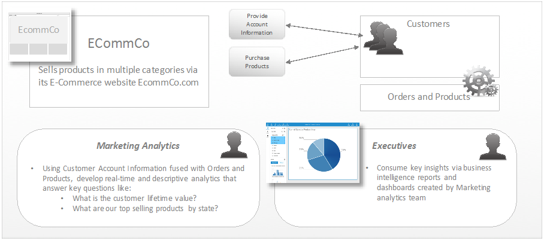

Figure 5: ECommCo at a high level

The Quick Start dataset includes representative full-snapshot and streaming data
that demonstrate how data is submitted to, and ingested by, the data lake. This
data can then be used in descriptive, predictive, and real-time analytics to
answer ECommCo’s most pressing business questions. The Quick Start data is
summarized in Figure 6.

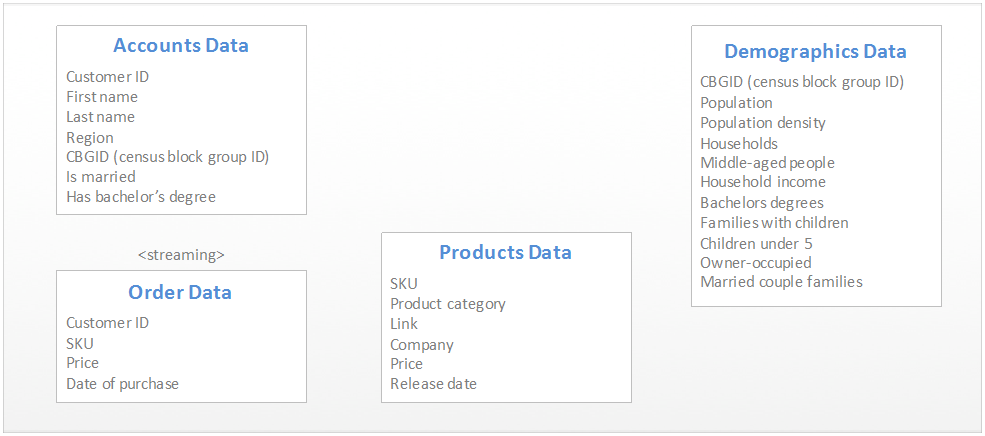

Figure 6: Quick Start sample data

For more information about the Quick Start dataset and the demonstration
analytics performed in the Quick Start environment, see the [47Lining Data Lake
Quick Start Sample Dataset
Description](http://www.47lining.com/datalake/quickstart-sample-dataset/).

Additional Resources
--------------------

**AWS services**

-   AWS CloudFormation  
    <https://aws.amazon.com/documentation/cloudformation/>

-   Amazon EBS  
    <https://docs.aws.amazon.com/AWSEC2/latest/UserGuide/AmazonEBS.html>

-   Amazon EC2  
    <https://aws.amazon.com/documentation/ec2/>

-   Amazon VPC  
    <https://aws.amazon.com/documentation/vpc/>

-   Amazon Kinesis  
    <https://aws.amazon.com/documentation/kinesis/>

-   Amazon S3  
    <https://aws.amazon.com/documentation/s3/>

-   Amazon Redshift  
    <https://aws.amazon.com/documentation/redshift/>

-   Amazon Redshift Spectrum  
    <http://docs.aws.amazon.com/redshift/latest/dg/c-using-spectrum.html>

-   Amazon Athena  
    <https://aws.amazon.com/documentation/athena/>

-   Amazon ES  
    <https://aws.amazon.com/documentation/elasticsearch-service/>

-   Kibana plug-in  
    <https://aws.amazon.com/elasticsearch-service/kibana/>

-   Amazon QuickSight  
    <https://aws.amazon.com/documentation/quicksight/>

**47Lining Data Lake Resources**

-   Data lake foundational concepts  
    <http://www.47lining.com/datalake/foundational-concepts/>

-   Data lake reference architecture  
    <http://www.47lining.com/datalake/reference-architecture/>

-   Data lake sample dataset details  
    <http://www.47lining.com/datalake/quickstart-sample-dataset/>

**Quick Start reference deployments**

-   AWS Quick Start home page  
    <https://aws.amazon.com/quickstart/>

    This lab manual was adapted from a document created by Amazon Web Services
    (AWS) in partnership with 47Lining (a REAN Cloud Company). 47Lining is an
    AWS Premier Consulting Partner specializing in big data.
